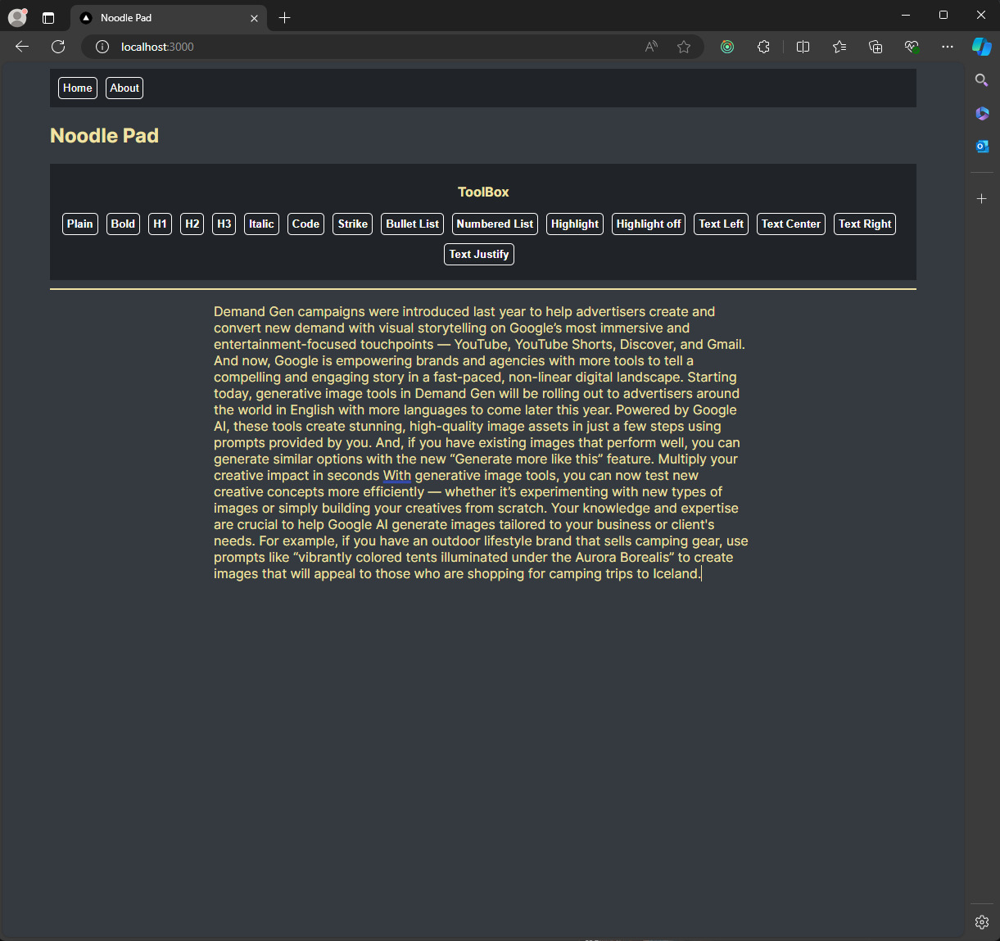
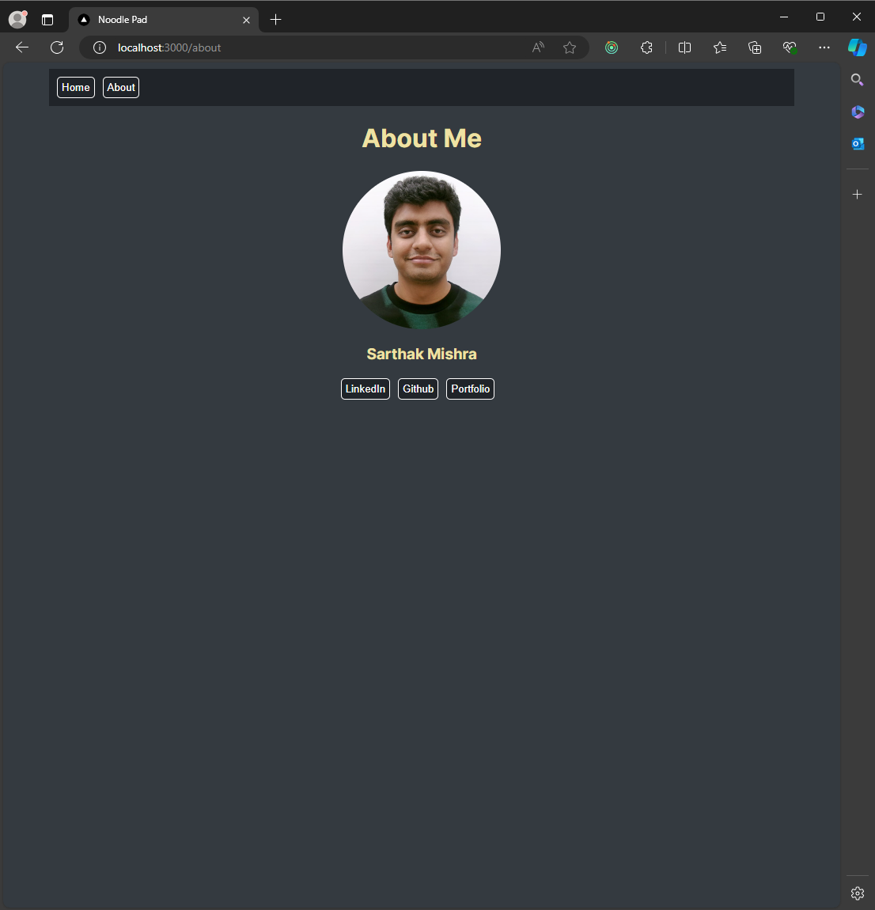

# Noodle Pad

Noodle Pad is a simple yet powerful text editor built using Next.js with TypeScript. It allows users to create and edit text documents seamlessly, with the added functionality of saving content in the browser's localStorage. This ensures that your work is preserved and ready for you when you return. This project is live on vercel.

## Key Features
- **Rich Text Editing:** Utilizes the Tiptap npm package to provide a robust and customizable text editing experience.
- **Autosave:** Automatically saves your work to localStorage, so you never lose your progress.
- **Seamless Continuation:** Resume your work exactly where you left off, every time you open the editor.
- **User-Friendly Interface:** Clean and intuitive design for a smooth user experience.

## Short Description
Noodle Pad is a text editor application designed to enhance your writing workflow. Built with Next.js and TypeScript, it features a rich text editor powered by Tiptap and an autosave function using localStorage. Whether you’re drafting a document or jotting down notes, Noodle Pad ensures your content is always safe and accessible.

## Snippets

<h3>Noodle Pad Editor</h3>

<h3>Noodle Pad About</h3>

## Tech Used
- **Front-end Framework:** Next.js
- **Programming Language:** TypeScript
- **Text Editor:** Tiptap npm package
- **Storage:** localStorage
- **Deployment:** Vercel

## How to Use

1. Clone the repository: `git clone https://github.com/sarthakmishraa/noodle-pad.git`

Feel free to clone the repository and explore the project.

## Contributing
Contributions are welcome! Please fork the repository and submit a pull request.